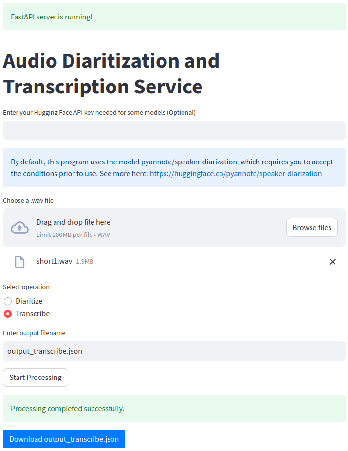
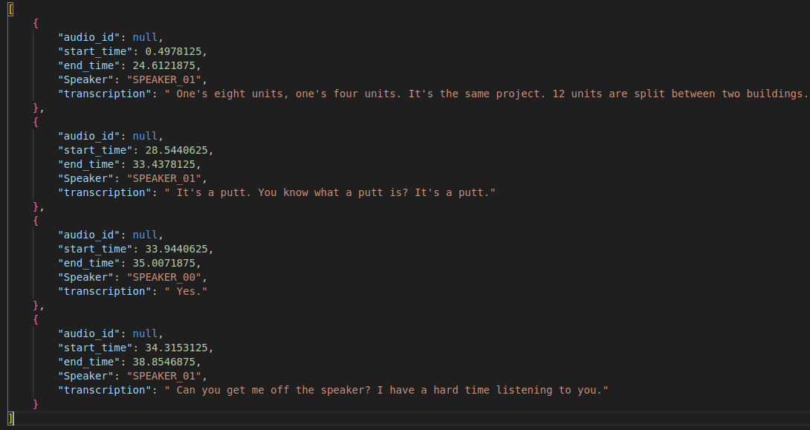

# Audio Diarization and Transcription with FastAPI

Welcome to our repository! This project utilizes Python to perform audio diarization and transcription on a streaming WAV file. The application is built using FastAPI and offers a user-friendly interface developed with Streamlit.



## Project Structure

Our project is structured with the following core components:

- `Diarization.py`: This file encapsulates the diarization process, which includes processing an audio stream and extracting speaker segments.
- `Transcription.py`: This script is responsible for transcribing speaker segments into text.
- `app.py`: Here, you'll find the FastAPI application defined, along with the endpoints responsible for handling audio diarization and transcription.
- `ui.py`: This file houses the Streamlit user interface, which enables file uploads, request handling, and displaying results.
- `main.py`: This is the primary script that runs both the FastAPI server and the Streamlit UI.
- `requirements.txt`: This contains all the Python packages required for running the project.
- `README.md`: The file you're currently reading, offering comprehensive information about the project and instructions for its execution.

Sure! Let's add the additional installation instructions and terms for accessing the Hugging Face API and the pyannote/speaker-diarization model to the README:

## Installation

To install and set up this project on your local machine, follow these steps:

1. Create a new Conda environment with Python 3.8.17:

    ```bash
    conda create -n myenv python=3.8.17
    ```

2. Activate the newly created Conda environment:

    ```bash
    conda activate myenv
    ```

3. Clone this repository to your local machine:

    ```bash
    git clone https://github.com/llamasaresavager/DecaDiarization.git
    ```

4. Navigate to the cloned project directory:

    ```bash
    cd DecaDiarization
    ```

5. Rename the `.env.sample` file to `.env` and update it with your configuration:

    ```bash
    mv .env.sample .env
    ```

6. Register for a Hugging Face API key by visiting [https://huggingface.co/join](https://huggingface.co/join). After obtaining your API key, add it to the `.env` file as follows:

    ```
    HUGGING_FACE_API_KEY=YOUR_HUGGING_FACE_API_KEY
    ```

7. Before using the pyannote/speaker-diarization model from Hugging Face, you need to agree to the terms and conditions specified by the model. The model requires you to share your contact information to access it. This repository is publicly accessible, but you have to accept the conditions to access its files and content.

    The collected information will help acquire a better knowledge of pyannote.audio userbase and help its maintainers apply for grants to improve it further. If you are an academic researcher, please cite the relevant papers in your own publications using the model. If you work for a company, please consider contributing back to pyannote.audio development (e.g. through unrestricted gifts). We also provide scientific consulting services around speaker diarization and machine listening.

    For more information and to accept the terms, please visit the pyannote/speaker-diarization model page on Hugging Face: [https://huggingface.co/pyannote/speaker-diarization](https://huggingface.co/pyannote/speaker-diarization).

8. Install all the necessary Python packages from the `requirements.txt`:

    ```bash
    pip install -r requirements.txt
    ```

## Usage

To use this project, follow these steps:

1. Start the FastAPI server and the Streamlit UI by running the following command in your terminal:

   ```bash
   python main.py
   ```

This command will initiate the FastAPI server and launch the Streamlit UI. Now, you can use the UI to upload a WAV file, select a task (either diarization or transcription), and choose a destination for the output file. The chosen task will process the uploaded file, and the results will be displayed in the Streamlit application and also saved to the specified destination.

Please ensure to have a valid WAV file for diarization and make adjustments to the request accordingly.

## Contact Information

I am currently job searching and if you have any inquiries or would like to get in touch, can be reached at:

Email: trevor@pertainium.com

Feel free to reach out if you have any questions or opportunities related to this project or any other relevant matters.

## Example Result

To provide an example of the output generated by the application, we have included a result image below:



This image showcases the diarization and transcription results for a sample audio file.

## Contributing

We warmly welcome contributions to this project. If you discover any issues or if you have suggestions for improvements, please don't hesitate to open an issue or submit a pull request.

## License

This project is released under the [MIT License](LICENSE). Please refer to the linked document for detailed information.